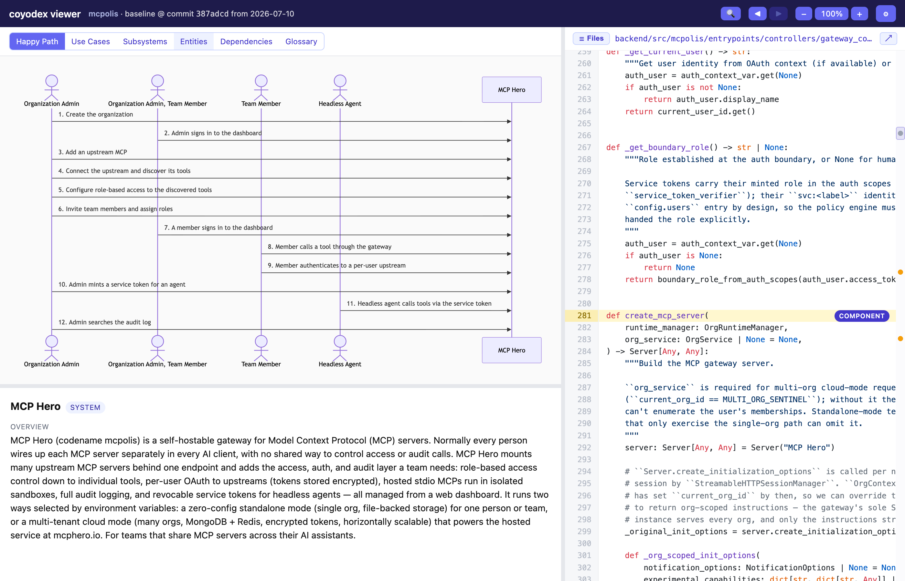

<div align="center">

# coyodex


### Vibe code without running off the cliff

</div>

When your agent generates a lot of code for you, you can end up with code you've
completely lost track of. It runs fine until the day you need to understand it,
and then you find there's nothing under your feet. This is the Coyote Effect.

coyodex lets you keep a high-level view of your whole project without reading all of it,
and drill into the code only when and where you need to. You drive it from your AI coding
agent to:

- **build a baseline map**: an annotated view of your whole project, functional and
  technical, drillable to `file:line`, committed next to the code so the two don't drift.
- **analyze a code diff** against it: what each change adds, touches, and ripples to,
  in the project's own terms.



*The interactive viewer: the Happy Path (what the system does, end to end) beside the real source
each step is grounded in.*

## Why not just generate mermaid diagrams from the code?

You could ask an agent to draw a mermaid diagram of your code. coyodex differs in four ways:

1. **Grounded, explorable map.** Every box is anchored to a real `file:line`, and explorable through
   an interactive UI: drillable top-down (system → subsystem → component → source) and bidirectional
   (from a use case to the elements it touches, and from any element back to the use cases that touch
   it).
2. **Explained in plain language.** Every box and arrow carries a natural-language annotation: what a
   component is for, what one thing does to another, what a domain entity means. Not just a labeled
   graph.
3. **Reliable extraction + verification.** Indexing and code-sizing tools help the agent read facts
   from the code instead of guessing. Then two checks: a validation pass that flags internal
   contradictions and boxes that don't map to real code, and an adversarial pass where fresh agents
   try to disprove each relationship against the code.
4. **Change-impact analysis.** What a diff adds, touches, and ripples to, in the project's own terms.

## How to use

coyodex runs as an agent skill on Claude Code, Codex, and Cursor. Install it once, then drive
everything with `/coyodex`.

### Installing

**Requirements:**

- **Python 3.10+.** `make install` builds an isolated virtualenv (`.venv/`) in the repo, so nothing
  lands in your system Python.
- **git**, and a **macOS/Linux** shell.

**Install the skill (once).** Clone this repo, then from its root run:

```
make install
```

This installs the skill into each agent's global skills home (`~/.claude/skills` for Claude Code,
`~/.agents/skills` for Codex and Cursor).

It also builds a repo-local virtualenv with the `coyodex` CLI. Re-run `make install` only if you move
the repo.

### Building a map

**1. Build the baseline.** In your project, with no map yet, `/coyodex` builds it:

```
/coyodex
```

Writes the map to `.coyodex/` (a JSON model plus a readable markdown view), pinned to the current
commit. Commit the `.coyodex/` folder with your code. The interactive viewer isn't a committed file;
it's served live from the model (below).

**2. View the map.** A small local server renders the viewer. Start it once, from the coyodex clone:

```
make start
```

It serves a landing page at `http://127.0.0.1:8765/`. Every project you map shows up there as a card;
click it to open the map. Leave the server running.

### Analyzing changes

**1. Edit your code.** Work as usual.

**2. Analyze the change.**

```
/coyodex analyze
```

Writes a report to `.coyodex/analysis-changes/<date>.md`: what your change adds, touches, and ripples
to. It's left uncommitted so you can review it first; the baseline isn't touched yet.

**3. Accept the change.**

```
/coyodex accept
```

Updates the map to reflect your change, re-pins it to the new commit, and commits it with the report.

Then keep coding and repeat steps 1–3.

On any agent beyond the three above, each step also works by pasting *"Read `method.md` and follow it
to …"* to any agent that can read this repo.

## The workflow

```
/coyodex ────────▶ .coyodex/project-map.json (committed, commit-pinned; + markdown view + preindex.json)
                   interactive viewer served live by `coyodex serve` (not a file)
   │
   ▼
edit code
   │
   ▼
/coyodex analyze ──▶ .coyodex/analysis-changes/<date>.md (report: modified / added / deleted, uncommitted)
   │
   ▼
/coyodex accept ──▶ patch the map, re-render the markdown view + pre-index, bump the commit pin, commit the map + pre-index + the report
```

The map is committed *with* the code, so the baseline commit and the code commit stay in step.

## Asking for map changes

You can also **just ask for changes** in plain language, and coyodex edits the map for you:

```
/coyodex move the payments module into a new "Billing" subsystem
/coyodex the "utils" component is really two things, split it
/coyodex rename the "API" subsystem to "Public API"
/coyodex add a use case for an admin resetting a user's password
```

coyodex makes the edit directly to the map, runs the same checks as any other change
(validate → audit → render), and commits it. Same map, edited on request; no special mode.

Two things to know:

- **It stays grounded in the code.** coyodex will reorganize or rename what's there, but it won't
  invent things the code doesn't do; an "add a use case" only sticks if there's real code behind it.
- **A rebuild is a fresh start.** If you later rebuild the map from scratch (which you have to ask for
  explicitly), your manual tweaks aren't re-applied. Day to day you analyze and accept, which keeps them.

## Status

**Alpha, v0.1.0. Experimental and incomplete.** Expect breaking changes, including to the on-disk map
format, so a newer version may not read an older map. Good for evaluating and giving feedback; not yet
something to depend on.

**What works today**

- Build a baseline map of a repo and render it as an interactive, drillable C4 viewer.
- Analyze a code diff against the map, overlay what changed and what it ripples to, and accept the
  result back into the baseline.
- Open a component's or entity's source straight from the viewer, in your editor (VS Code, Cursor,
  IntelliJ, …) or on GitHub.

**Known gaps / rough edges**

- The map format and the method are still moving; treat maps as disposable.
- Tested mainly on small and medium repos; behavior on large codebases is unexplored.
- Map quality depends on the coding agent and model; expect to review and correct it.
- The viewer is a browser page. On github.com the committed HTML shows as source, not rendered; view
  it via GitHub Pages or a raw-HTML proxy (e.g. raw.githack.com).

Feedback and bug reports are welcome, please [open an issue](../../issues).
