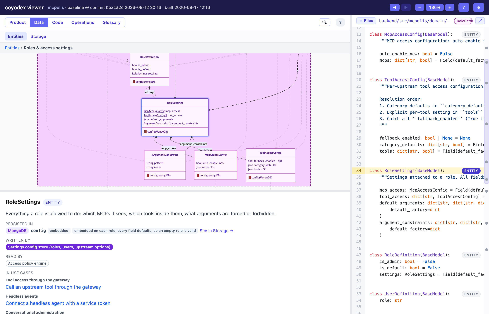

<div align="center">

# coyodex


### Vibe code without running off the cliff

</div>

## What is coyodex?

coyodex analyzes your project and builds an interactive map where every box is
annotated in plain language by your coding agent and anchored to code locations.
Use it to understand what your system does and how, top-down, without reading all
of it. Drill into the code only where and when you actually need to.



*The viewer: one part of a project's domain model, the selected box explained in plain language, and the code it is grounded in.*

The viewer presents the map as a set of tabs. Each tab is a different diagram of the same project,
and each one answers one question:

- **Happy Path** — What does this system do, end to end?
- **Use Cases** — Who uses it, and what does each of them get done?
- **Entities** — What things does this system know about, and how do they relate?
- **Subsystems** — How is the code organised, and what depends on what?
- **Dependencies** — What does it rely on from the outside world?
- **Data** — What is stored, where, and who reads and writes it?
- **Deployment** — What runs as its own process, and how do those talk to each other?
- **System** — The operational facts no diagram holds: how to run it, watch it, secure it, configure it.
- **Glossary** — What do this project's words mean?
- **Tests** — What is covered by tests, and what is not?

## Why coyodex?

When your agent generates a lot of code for you, you can end up with code you've
completely lost track of. It runs fine until the day you need to understand it,
and then you find there's nothing under your feet. This is the Coyote Effect.

coyodex helps you recover from this situation and oversee your agent's work moving forward.

## Why not just ask my agent to diagram the code?

Sure, you can ask your agent to analyze the code and draw mermaid diagrams. But coyodex differs in
three ways:

1. **Grounded, explorable map.** Every box is anchored to a real `file:line`, and explorable through
   an interactive UI: drillable top-down, from high level components to code locations, and back.
2. **Annotated in plain language.** Every box and arrow carries a natural-language explanation of the functionality and the implementation.
3. **Tool-guided extraction and verification.** Indexing and code-sizing tools help the agent extract information from the code, then a final adversarial pass has fresh agents try to disprove each claim against the code.


## How to use

coyodex runs as an agent skill on Claude Code, Codex, and Cursor. Install it once, then drive
everything with `/coyodex`.

### Installing

**Requirements:**

- **Python 3.10+.** `make install` builds an isolated virtualenv (`.venv/`) in the repo, so nothing
  lands in your system Python.
- **git**, and a **macOS/Linux** shell.

**Install the skill (once).** Clone this repo, then from its root run:

```
make install
```

This installs the skill into each agent's global skills home (`~/.claude/skills` for Claude Code,
`~/.agents/skills` for Codex and Cursor).

It also builds a repo-local virtualenv with the `coyodex` CLI. Re-run `make install` only if you move
the repo.

### Building a map

**1. Build the baseline.** In your project, with no map yet, `/coyodex` builds it:

```
/coyodex
```

Writes the map to `.coyodex/` (a JSON model plus a readable markdown view), pinned to the current
commit. Commit the `.coyodex/` folder with your code. The interactive viewer isn't a committed file;
it's served live from the model (below).

**2. View the map.** A small local server renders the viewer. Start it once, from the coyodex clone:

```
make start
```

It serves a landing page at `http://127.0.0.1:8765/`. Every project you map shows up there as a card;
click it to open the map. Leave the server running.

### Asking for map changes

You can also **just ask for changes** in plain language, and coyodex edits the map for you:

```
/coyodex move the payments module into a new "Billing" subsystem
/coyodex the "utils" component is really two things, split it
/coyodex rename the "API" subsystem to "Public API"
/coyodex add a use case for an admin resetting a user's password
/coyodex drill deeper into the "Billing" subsystem — I need more detail there
```

**A rebuild is a fresh start.** If you later rebuild the map from scratch (which you have to ask for
explicitly), your manual tweaks aren't re-applied.

On any agent beyond the three above, these steps also work by pasting *"Read `method.md` and follow it
to …"* to any agent that can read this repo.

## Which files are analyzed

coyodex takes every file in your project, except two sets: what your `.gitignore` excludes, and what
`.coyodex/.ignore` excludes. git decides the first one, so all the usual rules hold, including a
`.gitignore` inside a subfolder. `.coyodex/.ignore` uses the same syntax, and is for the other case:
code that *is* committed, but that you don't want on the map — a vendored copy, checked-in build
output, a fixture tree.

## Status

**Alpha, v0.1.0. Experimental and incomplete.** Expect breaking changes, including to the on-disk map
format, so a newer version may not read an older map. Good for evaluating and giving feedback; not yet
something to depend on.

**What works today**

- Build a baseline map of a repo and render it as an interactive, drillable C4 viewer.
- Ask for map changes in plain language — move, split, rename, or drill deeper into any part.
- Open a component's or entity's source straight from the viewer, in your editor (VS Code, Cursor,
  IntelliJ, …) or on GitHub.

**Known gaps / rough edges**

- The map format and the method are still moving; treat maps as disposable.
- Tested mainly on small and medium repos; behavior on large codebases is unexplored.
- Map quality depends on the coding agent and model; expect to review and correct it.
- The viewer is a browser page. On github.com the committed HTML shows as source, not rendered; view
  it via GitHub Pages or a raw-HTML proxy (e.g. raw.githack.com).

Feedback and bug reports are welcome, please [open an issue](../../issues).
