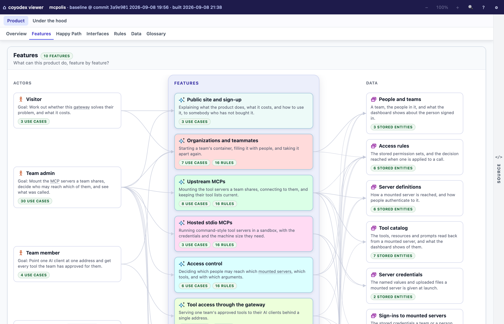
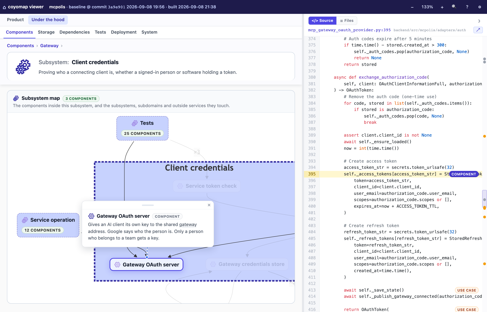

<div align="center">

# coyodex


### Agentic coding without running off the cliff

</div>

## What is coyodex?

coyodex analyzes your project and builds an interactive map of its features, in plain language,
linked to the underlying architecture and code. Use it to understand what your product does and
how it is implemented, top-down, without reading all the code. Drill into the code only where and
when you actually need to.

## Why coyodex?

When coding agents generate most of your code, you can lose track of your project's features
and implementation. Everything runs fine until the day you look down and see there is nothing
under your feet. This is the Coyote Effect.

coyodex helps you recover from this situation and oversee your agent's work moving forward.

The map is also a shared picture: a product manager reads what is in the project on the same map
the developer works from.

## What coyodex shows

The viewer shows a map in two groups.

**Product** — the product's functionality: its features and use cases, the happy path, the rules it
enforces, and what it knows about.



*The Product group, on the Features page: who uses the product, what it does, and the data behind each
feature.*

**Under the hood** — how it is built and run: its components and their dependencies, where data is
stored, how it is deployed.



*Under the hood, on the Components page: one subsystem's map, the selected component explained in one
sentence, and its code beside it at the line the map points to.*

Start from a feature and drill down: the interfaces and data it touches, the components that do the
work, and the code behind each.

## Why not just ask my agent to explain the code?

Sure, you can ask your agent to analyze the code and draw diagrams. But coyodex differs in
two ways:

- coyodex builds an explorable, hierarchical map: every box has a plain-language note, links to
  related boxes, and links into the architecture and code. The map is saved with the project, so
  everyone sees the same one.
- An AI agent can miss things or make things up. So coyodex reads the code with the help of an
  index, makes every claim point at a real file and line, checks the map for gaps and
  contradictions, and has fresh agents try to prove each claim wrong before the map is written.

## How to use

coyodex runs as an agent skill on Claude Code, Codex, and Cursor. Install it once, then drive
everything with `/coyodex`. You need a checkout of the project and one of the three agents. Having
written the code, or reading it, is not required.

### Installing

**Requirements:**

- **Python 3.10+.** `make install` builds an isolated virtualenv (`.venv/`) in the repo, so nothing
  lands in your system Python.
- **git**, and a **macOS/Linux** shell.

**Install the skill (once).** Clone this repo, then from its root run:

```
make install
```

This installs the skill into each agent's global skills home (`~/.claude/skills` for Claude Code,
`~/.agents/skills` for Codex and Cursor).

It also builds a repo-local virtualenv with the `coyodex` CLI. After you update the clone
(`git pull`), or if you move it, run `make install` again: it refreshes both the tool and the skill.

### Building a map

**1. Build the baseline.** In your project, with no map yet, `/coyodex` builds it:

```
/coyodex
```

Before reading anything, coyodex prints what it is about to read: how many files, what each ignore
pattern removed, and which commit the map will be pinned to. If you have uncommitted changes, it
asks whether to wait for a commit.

The map lands in `.coyodex/`, pinned to that commit: the map itself (JSON), a readable markdown
rendering of it, the code index, a stamp saying which session built it, and the verdicts of the
verification pass. Commit the folder with your code. The interactive viewer isn't a committed file;
it's served live from the map (below). With a map already there, `/coyodex` tells you whether the
map still matches the code; it never rebuilds on its own.

**2. View the map.** A small local server renders the viewer. Start it once, from the coyodex clone:

```
make start
```

It opens a landing page at `http://127.0.0.1:8765/`. Pick your project's folder there once; the
server remembers it and shows it as a card from then on. Leave the server running. A map's address
starts with `/coyodex/`, and `.venv/bin/coyodex url <ID> --repo <repo>` prints the address of one
element, already selected — ask your agent to "show me X in the map" and it ends with that link.

### Asking for map changes

You can also **just ask for changes** in plain language, and coyodex edits the map for you:

```
/coyodex move the payments module into a new "Billing" subsystem
/coyodex the "utils" component is really two things, split it
/coyodex rename the "API" subsystem to "Public API"
/coyodex add a use case for an admin resetting a user's password
/coyodex drill deeper into the "Billing" subsystem — I need more detail there
```

Every edit runs the same checks as a build. Ask for a feature the code does not have, and coyodex
says so instead of drawing it.

**A rebuild is a fresh start.** If you later rebuild the map from scratch (which you have to ask for
explicitly), your manual tweaks aren't re-applied.

On any agent beyond the three above, these steps also work by pasting *"Read `method.md` and follow it
to …"* to any agent that can read this repo.

## Which files are analyzed

coyodex takes every file in your project, except two sets: what your `.gitignore` excludes, and what
`.coyodex/.ignore` excludes. git decides the first one, so all the usual rules hold, including a
`.gitignore` inside a subfolder. `.coyodex/.ignore` uses the same syntax, and is for the other case:
code that *is* committed, but that you don't want on the map — a vendored copy, checked-in build
output, a fixture tree. The build reports what each pattern removed, so an exclusion never goes
unnoticed.

## Status

**Work in progress, in daily use.** As of September 2026, coyodex has built 35 maps of three real
projects. Before a map is written, fresh agents challenge its claims against the code, and their
verdicts are stored next to the map. The version number lives in the [`VERSION`](VERSION) file at
the repo root.

**What works today**

- Build a map of a repo and render it as an interactive, drillable viewer.
- Ask for map changes in plain language — move, split, rename, or drill deeper into any part.
- Open a component's or entity's source straight from the viewer, in your editor (VS Code, Cursor,
  IntelliJ, …) or on GitHub.

**Known gaps / rough edges**

- The stored map format still moves: a newer coyodex may not read an older map. A rebuild is the
  fix, and it is cheap, so treat a map as replaceable.
- Two builds of the same commit agree on the code, not on the wording: names and sentences can
  differ between rebuilds.
- Exercised on repos of 400 to 1,000 tracked files; larger codebases are unexplored.
- Map quality depends on the coding agent and model: read it, and correct it. If you do not read
  code, the code link is what you hand to someone who does.

Feedback and bug reports are welcome, please [open an issue](../../issues).
