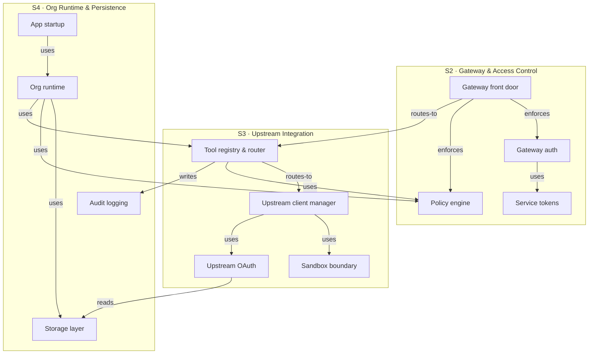
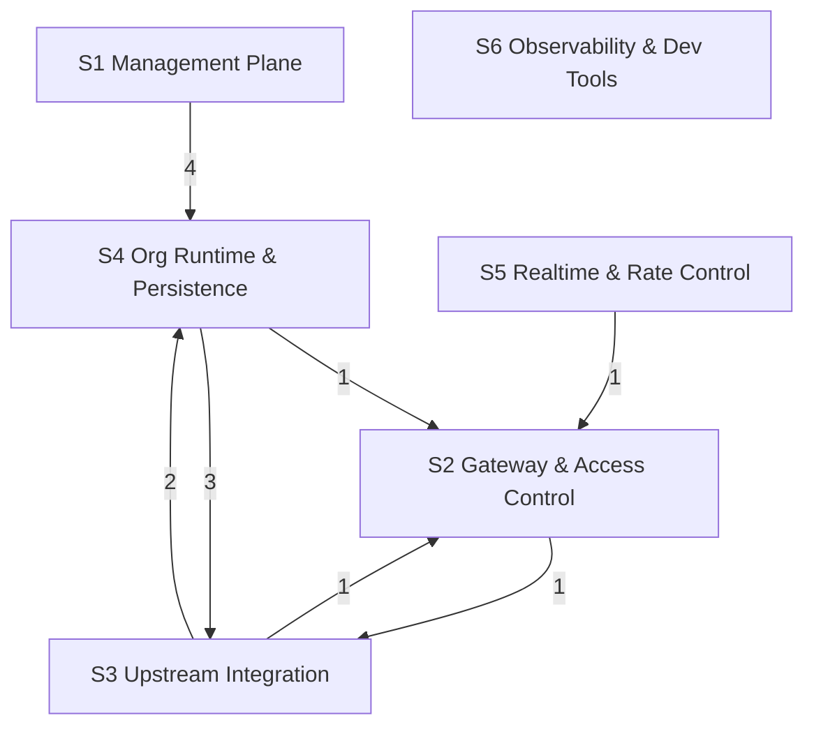

# Design proposal — grouping / hierarchical nesting for the map

A design extension for coyodex: add a **grouping signal** so components (and, optionally,
other elements) can be organized into **subsystems**, with several levels of nesting. The
goal is to add the **Container altitude** that C4 has and coyodex lacks — an intermediate
zoom between "whole project" and "one component" — and to make both **generation** and
**interpretation** scale on large maps.

This file follows the [design-notes](design-notes.md) style: every decision is pressure-tested
with a rejected alternative.

---

## Summary — the chosen design in five lines

1. **One new element type: the Subsystem, prefix `S`**, defined in its own table (like `C`/`D`/`E`).
2. **Membership = one parent pointer stored on the child.** A component row gains a `Subsystem`
   column (one `S` ID). A subsystem row gains a `Parent` column (one `S` ID, or empty = top-level).
   Nothing stores a child list — the member view is **derived**.
3. **Nesting falls out for free**: a parent pointer that can point at another `S` gives N levels.
   The method recommends ≤2–3 levels; the validator enforces a max depth and rejects cycles.
4. **Inter-group edges are derived**, never authored: `S1 → S2` exists iff some component edge
   `Cx → Cy` crosses from `S1` to `S2`. The hairball collapses (mcpolis, experiment-verified:
   23 component→component edges → 7 subsystem edges, 21 boxes → 6).
5. **Additive and backward-compatible**: a map with no `S` table and no `Subsystem` column
   validates exactly as today. All new validator checks are no-ops when grouping is absent.

This respects every standing constraint: single source / derived views, stable flat prefixed IDs,
diagram = rendering (no second model), GitHub-safe Mermaid, confidence carried through.

---

## The problem (grounded)

T1 Components is a **flat list**. On mcpolis the map has **21 components (C1–C21)** with a
**31-row backbone edge list (23 of them component→component, the rest to external deps)**.
Rendered as one Mermaid diagram it is a dense hairball, and the flat list does not scale:

- **Generation**: the agent must reason over all 21 components and all edges at once — no way to
  divide the work or bound an agent's context to a part of the system.
- **Interpretation**: there is no altitude between "whole project" (all 21) and "one component"
  (file:line). C4 has **Container/subsystem** above Component; coyodex has no equivalent.

We want a grouping signal — possibly multi-level — that gives that missing altitude, with the
least new machinery, without breaking the flat-ID + validator-regex model.

---

## Q1 — Representation: the Subsystem (`S`) table

**Decision: a dedicated Subsystems table with a new ID prefix `S`.** Subsystems are
**first-class drillable elements**, defined in their own table exactly like every other altitude
in coyodex. The table:

```
| ID | Subsystem | Purpose | Parent | Anchor | Conf. |
```

- `ID` = `S1`, `S2`, … (stable, flat, prefixed — same shape as `C`/`D`/`E`).
- `Purpose` = the one-line "what this part is" — the altitude promise: read the subsystem's
  purpose without drilling into its components.
- `Parent` = the **one** `S` ID this subsystem nests inside, or empty for top-level (see Q3).
- `Anchor` = a `file:line` or **directory** the subsystem maps to (drillable; doubles as the
  evidence for the grouping).
- `Conf.` = verified / inferred — grouping is often **inferred** from directory structure or
  cohesion, so it must carry confidence like everything else.

There is **no `Members`/`Contains` column** — the member list is derived (Q2).

**Why a table with a new prefix, and not the lighter alternatives:**

| Option | What it is | Verdict |
|---|---|---|
| **A. `Group` text column on T1** | one extra T1 cell holding a group *name* | **Rejected.** A group needs a stable ID (so edges, diagrams, the change report, "Used in GP" can reference it), a Purpose, a confidence, and an anchor. A name-only cell can carry none of those without either duplicating the group's Purpose across every member row (**drift** — violates single source) or bloating T1. A group is an *element*, not an attribute. |
| **B. Subsystem table + `S` prefix** *(chosen)* | groups are ID'd rows in their own table | **Chosen.** Mirrors how every coyodex altitude is a table of ID'd, drillable, confidence-bearing rows. The `S` ID is the single home for the group's purpose/anchor/confidence, and the reference target for diagrams + change-impact. |
| **C. Hierarchical IDs (`C1.2`)** | encode the tree in the ID | **Rejected hard.** Breaks the flat stable-ID model the validator parses by regex (`C\d+`). Worse, it **duplicates the tree into every reference** and makes IDs **unstable**: re-grouping `C8` → `C3.2` breaks every GP `Touches:`, every edge endpoint, every "Depends on" that named `C8`. Violates *both* "stable flat IDs" *and* "single source." This is the option the brief flagged as likely-bad; it is. |

**`S` does not collide** with the existing prefixes (`UC`, `R`, `GP`, `C`, `D`, `E`).

**Subsystem (logical) ≠ Deployment unit (physical).** coyodex already has a *Deployment &
topology* table (`Unit | Runs on | Exposed as | Config source`) — that is the **runtime**
container. The Subsystem is a **logical** cohesion grouping of your code. They often align but
not always (a subsystem can span deployment units). The map keeps them separate; the Deployment
table may *reference* `S` IDs, but it is not the grouping source.

---

## Q2 — Single source / no drift: child → parent

**Decision: membership lives on the child, as one parent pointer.** Each component row carries
its `Subsystem` (one `S` ID); each subsystem row carries its `Parent` (one `S` ID or empty). The
subsystem's member list is **derived** by the validator/renderer — never authored.

This is the exact analog of coyodex's existing single-source choices:

- The edge list stores `From — verb — To` **once**; T1 "Depends on" is a *derived* summary.
- Traceability stores `GP-step — touches → element` **once** (the forward `Touches:` line is the
  source); the backward "Used in GP" column is *derived*.

Here, membership is the edge `C — in → S`. We store it **once, on the child side**, and derive the
reverse ("which components are in `S3`").

**Why child → parent and not parent → children:**

| Option | Verdict |
|---|---|
| **child carries `Subsystem` (one `S` ID)** *(chosen)* | Membership is a **function** child → subsystem (exactly one parent, Q4). The natural home for a function's value is its domain element. Adding `C22` is **one cell edit on the row you're already adding**. "Exactly one parent" is the natural shape (one cell, one value), so the validator check is trivial. Re-grouping is a clean one-cell diff (Q8). |
| **parent lists `Contains: C1, C2, …`** | **Rejected.** (a) Adding `C22` means editing a *different* row (the subsystem) — easy to forget → **drift**. (b) Can't express "≤1 parent" structurally — nothing stops `C8` appearing in two `Contains:` lists. (c) If you also want a child-side view (you do — reading a component, you want its subsystem), you'd store the fact twice. |

**The single rule, stated once and applied recursively:** *every groupable element carries one
optional parent pointer; the hierarchy is the set of those pointers; every reverse view (members,
descendants, diagram nesting, grouped edge list, grouped touches) is derived.* Nothing stores a
child list anywhere.

---

## Q3 — Multi-level nesting

Because membership is a single parent pointer **and a parent can be another `S`**, nesting is free:

```
C8  Subsystem: S3        (component in subsystem S3)
S3  Parent:    S8        (S3 nests inside S8)
S8  Parent:    (empty)   (S8 is top-level)
```

N levels, zero new machinery — the tree is just the parent-pointer forest, walked transitively.

**How deep is sane: a soft cap of `MAX_DEPTH = 3` subsystem levels** — i.e. a membership chain
from any element up to its top-level subsystem may have at most 3 parent-pointer hops (so a
component may sit under up to 3 nested subsystems: `C → S → S → S`). Rationale, grounded in the
altitude argument:

- coyodex's value is "one screen, whole project" with a *small* number of intermediate altitudes.
  C4 itself is four fixed levels. If you need >3 subsystem levels above a component you
  have rebuilt a deep directory tree, which defeats the "one screen" promise.
- Mermaid subgraphs nest cleanly to ~2–3 levels and get noisy beyond — the presentation layer
  agrees with the cap.

**Parseable + presentable:** depth is computed by walking parent pointers; a revisit = a **cycle**
(error). The validator enforces a configurable `MAX_DEPTH` (default 3) and rejects cycles (Q4).
At the top, render only parent-less `S` nodes; drilling a subsystem reveals its child subsystems
and/or components.

---

## Q4 — ID scheme + validator

**New prefix `S`**, defined in the first cell of a Subsystems-table row (`| **S1** | … |`), exactly
like `C`/`D`/`E`. Two one-line regex additions (shown in *Concrete edits*): add `S\d+` to the
reference token and to the bold-definition pattern.

**New checks — all additive (no-ops when there is no `S` table / `Subsystem` column):**

1. **Group IDs unique** — falls out of the existing duplicate-definition check once `S` is a
   definable prefix (the `counts` dict already dedupes by ID).
2. **Membership resolves** — every non-empty `Subsystem`/`Parent` value is a *defined* ID. Partly
   covered by the existing "references resolve" check (now that `S3` is tokenized); a sharper
   targeted check is added so the message names the offending child.
3. **Parent type** — a component's `Subsystem` and a subsystem's `Parent` must be an **`S`**
   (not a `C`/`D`/`E`).
4. **≤1 parent per element** — the `Subsystem`/`Parent` cell holds **at most one** ID token; two
   tokens = error.
5. **No nesting cycles** — walk parent pointers; revisiting a node = error (`S1→S2→S1`).
6. **Max depth** — walk to root; depth `> MAX_DEPTH` (default 3) = error.

Not enforced — **ungrouped components are legal** (a component with no `Subsystem` is just
top-level). This is what keeps the change additive: existing maps and partially-grouped maps both
pass. Everything stays **stdlib-only** (regex + a dict + a DFS over a tiny forest).

GP `Touches:` lines stay at component/entity/dep granularity. A GP step "touches" a subsystem is
**derived** (it touches `S3` iff it touches any component in `S3`) — so `S` is *not* added to
`Touches:`, keeping the single-source rule.

---

## Q5 — Diagrams / viewer

**Mermaid subgraphs (GitHub-safe, nestable).** Each top-level `S` becomes a `subgraph`; nested `S`
becomes a nested `subgraph`; components are nodes inside. `subgraph` is core Mermaid syntax that
renders on GitHub — no edge-id syntax, so it stays within the viewer's existing GitHub-safe rules.
(See the worked example for the sketch.)

**The C4 Container level = the Subsystems.** The [diagrams](../../method/diagrams.md) drill-down table
gains the subsystem as the logical Container view:

```
| Container | logical: Subsystems (S, nested) · physical: Deployment units | the S table + Deployment |
```

The subsystem boxes are the containers; the existing component diagram becomes the **drill-in**
from a container.

**Collapse / expand + drill-down in the viewer.** A subsystem subgraph collapses to a single box
(hiding its components) or expands. Drilling a subsystem box zooms into its component sub-diagram —
exactly the viewer's deferred **P4 "drill-down (per-level diagrams + breadcrumb)"** phase; grouping
supplies the levels it was missing. `S` IDs get `cy-S3` classes like every node, so the existing
**DOM↔schema-ID bridge works unchanged** (the viewer resolves a clicked box → element by its
`cy-<ID>` class).

**Inter-group edges are DERIVED, never hand-maintained** — the key single-source point for
diagrams. The renderer **lifts** each component edge to its endpoints' subsystems:

> `S_a → S_b` exists iff there is a component edge `Cx → Cy` in the T1 backbone with
> `Cx ∈ S_a`, `Cy ∈ S_b`, `S_a ≠ S_b`. Dedupe. The underlying-edge count annotates the arrow; the
> verb defaults to the set of underlying verbs (or plain `uses` when mixed).

Nothing about inter-group edges is stored in the markdown — they are computed from
*(component edges) + (membership)*, mirroring "T1 Depends-on is derived from the edge list." This
is what tames the hairball: the top diagram is ~6 boxes and a handful of derived arrows; drill a
box for its internal component edges.

---

## Q6 — Generation scalability

**How the agent assigns groups (bottom-up clustering during synthesis).** Grouping slots into the
existing *build bottom-up, present top-down* order. Today: `T3 → harvest T4/T2/T5 → synthesize T1
→ trace T6 + edges`. Insert a **clustering step right after T1 synthesis**, once components exist
and the edge list is roughly traced. Cluster by these signals, in priority order:

1. **Directory / package structure** — strongest, cheapest, often already the grouping
   (`adapters/`, `domain/services/`, `entrypoints/`). Path-derived → can be **verified**.
2. **Dependency cohesion** — components densely connected in the edge list and sparsely connected
   to the rest (cut the graph at its thin points). The edge list is already the input.
3. **Behavioral cohesion** — components that co-occur in the same use cases / Golden Path steps'
   `Touches:` lines.
4. **Naming** — shared name stems ("Gateway front door", "Gateway auth").

The agent picks the cut that **minimizes inter-group edges** while keeping each group **nameable
with a one-line purpose**. Directory-derived groups are verified-ish; cohesion-derived groups are
**inferred** (mark them).

**Divide-and-conquer generation, via the existing parallel mode (harvest → synthesize → trace):**

- **Synthesis barrier (Phase 2) also assigns subsystems.** The single synthesis agent already has
  the global node inventory — it is the right place to cut the graph (a *global* decision). This
  respects "the final reconcile is not delegated": subsystem assignment is part of the
  non-delegated synthesis, not fanned out.
- **Trace (Phase 3) fans out one agent per subsystem.** Each agent maps the **internal** edges of
  its ~4–6 components in depth; a final reconcile agent traces the **cross-subsystem edges** (the
  seams). This is literally "map each subsystem, then the cross-subsystem edges."
- **Bounded context per agent** is the real payoff: the agent for `S3` reads only `S3`'s
  components' code, cutting per-agent context from "whole repo" to "one subsystem." That is what
  lets generation scale past the point where one context can hold the whole map.

---

## Q7 — Interpretation scalability

Grouping restores the missing altitude and delivers "one screen, whole project" at scale:

- **Start at subsystem level.** The top screen is ~6 subsystem boxes + derived inter-group edges —
  readable, not a hairball. Each box shows its one-line Purpose, so you grasp the system shape
  **without drilling**.
- **Drill down**: subsystem box → its internal component diagram (4–6 nodes) → component → file:line.
  Three drillable altitudes (subsystem → component → code) where there were two.
- **Grouped edge list, derived.** The 23 component→component edges collapse to a handful of `S→S`
  edges ("Gateway routes-to Upstream Integration"). The reader reads the grouped edge list first,
  then drills into the component edges that realize each one. The grouped edge list is **derived**,
  not stored — same single-source rule.

---

## Q8 — Change-impact interaction

Grouping adds **no new artifact** to the diff → analyze → accept cycle; it adds one coarser
resolution rung and makes re-grouping a clean diff.

- **Subsystems are elements** — an `S` row is classified modified / added / deleted with
  patch-complete `was → now` text, so **accept stays mechanical** (no new inference). Adding
  components can add a subsystem; deleting all of a subsystem's components can delete it.
- **Membership changes are ordinary cell diffs.** Moving `C8` from `S2` to `S5` is a *modified*
  component row (its `Subsystem` cell changed) — captured by the existing `was → now` mechanism,
  no special machinery. This is a direct payoff of the child-side single-source choice: a re-group
  is **one cell** edit. (Parent-side `Contains:` lists would edit *two* subsystem rows per move —
  a noisier, drift-prone diff.)
- **Ripple at subsystem granularity** extends the existing **resolution-honesty ladder**:
  `subsystem → component → entity → GP step`. A high-blast-radius helper is honestly reported as
  "spans `S1`/`S3`/`S5`" — more useful than 12 component names. A purely-additive change inside one
  subsystem is honestly "contained in `S3`."
- **Derived inter-group edges need no diffing** — they re-derive from the component-edge diffs, so
  the report never maintains them (consistent with "deletions need no tombstone — the diff shows it").

---

## Q9 — Scope: components yes, entities on-demand, deps no

The `S`/parent mechanism is defined **generically** (any row can carry a parent pointer), but the
method applies it by default only where it pays:

| Element | Group it? | Reasoning |
|---|---|---|
| **Components (`C`)** | **Yes — primary** | This is where the hairball is and where the Container altitude is missing. The whole motivation. |
| **Entities (`E`)** | **On-demand (opt-in)** | Domain models do cluster into bounded contexts / aggregates (mcpolis: 14 entities — auth, upstream, audit…). Worth it on a large model, but the immediate pain is the component diagram, the entity list is usually shorter and already readable, and bounded-context lines are a contentious modeling call. Keep the machinery uniform so enabling `E` grouping later is free; list it among the **on-demand extras**. |
| **Deps (`D`)** | **No** | External deps are a flat inventory of what is *outside* your boundary; they don't form a subsystem hierarchy *of your code*. If categorization is ever wanted ("datastores", "observability"), that is a flat **tag**, not the `S` nesting — and it is low value. Keep scope tight. |

**Recommendation:** ship grouping for components; reuse the same `S`/parent mechanism for entities
only when a map opts in; do not group deps.

---

## Concrete edits

Diff-style; everything is additive. Nothing below changes how an existing (ungrouped) map parses
or validates.

### 1. `method/schema-v1.md`

**ID scheme table — add the `S` row:**

```diff
 | `C` | Component (T1) |
+| `S` | Subsystem — a group of components (and/or nested subsystems) |
 | `D` | External dependency (T2) |
 | `E` | Domain-model entity (T5) |
```

**Convention 2 (ID-based cross-references) — add membership to the list of references that must
resolve:**

```diff
-2. **ID-based cross-references** — every reference (T1 "Depends on", edge endpoints, GP
-   `Touches:`, traceability tables, "Used in GP") resolves to a defined ID …
+2. **ID-based cross-references** — every reference (T1 "Depends on", T1 `Subsystem`,
+   the Subsystems `Parent`, edge endpoints, GP `Touches:`, traceability tables, "Used in GP")
+   resolves to a defined ID …
```

**New subsection under "Derived, not duplicated":**

```markdown
### Grouping is single-source, like everything else

- **Membership lives on the child, once.** A component's `Subsystem` cell and a subsystem's
  `Parent` cell each hold **one** `S` ID (or empty = top-level). No table stores a member/child
  list — the member view is *derived*.
- **Inter-group edges are derived** from the component edge list + membership: `S_a → S_b` exists
  iff a component edge crosses from `S_a` to `S_b`. Never authored.
- **Grouped touches / grouped "Depends on" are derived** the same way. `S` is *not* written into
  `Touches:` lines.
```

**Validator section — list the new (additive) checks:**

```markdown
It also checks grouping when present (no-op when absent): subsystem IDs unique; every
`Subsystem`/`Parent` value resolves to a defined `S`; at most one parent per element; no nesting
cycles; nesting depth ≤ MAX_DEPTH (default 3).
```

### 2. `method.md`

**Structural layer, Level 0 — add the Subsystems table as the new lead altitude:**

```diff
 ### Level 0 (one screen, whole project)
+- **Subsystems (S)** *(default on large maps)*: `ID | Subsystem | Purpose | Parent | Anchor | Conf.`
+  — the Container altitude: components grouped into subsystems (optionally nested). Membership is
+  carried on the child (a `Subsystem` column on T1); the member list and the inter-subsystem edges
+  are *derived*, never authored. Present this first on large maps; drill into T1.
 - **T1 Components**: `Component | Purpose | Entry point | Depends on` (+ a `Subsystem` column → S ID).
 - **T2 External dependencies**: `Name | Type | Used for | Where configured`.
 - **T3 How to run/build/test**: `Action | Command | Source`.
```

**Build order — insert the clustering step:**

```diff
-T3 → harvest T4, T2, T5 (a full sweep …) → synthesize T1 → trace T6 + edge list.
+T3 → harvest T4, T2, T5 (a full sweep …) → synthesize T1 → **cluster components into Subsystems**
+(by directory, then dependency/behavioral cohesion; minimize inter-group edges; mark
+directory-derived = verified, cohesion-derived = inferred) → trace T6 + edge list.
```

**Parallel mode — two edits:**

```diff
 - Phase 2 Synthesize (barrier, one agent): T1 clusters/dedups all harvest outputs.
+  The same barrier agent assigns Subsystems (a global graph cut — not delegated).
 - Phase 3 Trace (fan out, one agent per use case/journey).
+  On large maps, fan out **one agent per subsystem** (bounded context: each reads only its
+  subsystem's components), then a non-delegated reconcile traces the cross-subsystem seams.
```

### 3. `method/templates/project-map.template.md`

**Add the Subsystems table just above T1, and a `Subsystem` column to T1:**

```diff
+## Subsystems (S) — the container altitude
+
+> Components grouped into subsystems (optionally nested). Membership is carried on each component
+> (T1 `Subsystem` column); members + inter-subsystem edges are derived. Omit this whole section on
+> small maps — ungrouped components are valid.
+
+| ID | Subsystem | Purpose | Parent | Anchor | Conf. |
+|---|---|---|---|---|---|
+| **S1** | <subsystem> | <one-line purpose> | <S-id or empty> | [dir/](path/) | inferred |
+
+---
+
 ## T1 — Components

-| ID | Component | Purpose | Entry point | Depends on |
-|---|---|---|---|---|
-| **C1** | <component> | <purpose> | [file](path#L1) | C2, C3 |
+| ID | Component | Subsystem | Purpose | Entry point | Depends on |
+|---|---|---|---|---|---|
+| **C1** | <component> | S1 | <purpose> | [file](path#L1) | C2, C3 |
```

### 4. `tools/validate_analysis.py`

**Two regex additions:**

```diff
-ID_TOKEN = re.compile(r"\b(?:UC\d+|GP\d+|C\d+|D\d+|E\d+)\b")
+ID_TOKEN = re.compile(r"\b(?:UC\d+|GP\d+|C\d+|D\d+|E\d+|S\d+)\b")
@@
-DEF_BOLD = re.compile(r"^\|\s*\*\*(UC\d+|C\d+|D\d+|E\d+)\*\*\s*\|")
+DEF_BOLD = re.compile(r"^\|\s*\*\*(UC\d+|C\d+|D\d+|E\d+|S\d+)\*\*\s*\|")
```

**New function — collect parent pointers from any `Subsystem`/`Parent` column:**

```python
PARENT_COLS = ("subsystem", "parent")
MAX_DEPTH = 3  # max subsystem levels (parent-pointer hops) in any membership chain

def collect_parents(text: str) -> tuple[dict[str, str], list[str]]:
    """child_id -> parent_id from any table column named Subsystem/Parent.
    Returns the mapping plus problems for multi-parent cells. No-op if no such column."""
    parents: dict[str, str] = {}
    problems: list[str] = []
    lines = text.splitlines()
    i = 0
    while i < len(lines):
        if not lines[i].lstrip().startswith("|"):
            i += 1
            continue
        block: list[str] = []
        while i < len(lines) and lines[i].lstrip().startswith("|"):
            block.append(lines[i]); i += 1
        if len(block) < 2:
            continue
        headers = [c.strip().lower() for c in block[0].strip().strip("|").split("|")]
        # The membership column. Exclude idx 1 — that is always the display-name
        # column (col 0 = ID, col 1 = name), and the S-table's name column is itself
        # titled "Subsystem", which would otherwise collide with T1's `Subsystem`
        # membership column. Picking the *non-name* match resolves both tables.
        pcol = next((idx for idx, h in enumerate(headers)
                     if h in PARENT_COLS and idx != 1), None)
        if pcol is None:
            continue
        for row in block[1:]:
            if "-" in row and re.fullmatch(r"[\s|:-]+", row.strip()):
                continue  # separator row
            cm = DEF_BOLD.match(row)
            if not cm:
                continue
            child = cm.group(1)
            cells = [c.strip() for c in row.strip().strip("|").split("|")]
            if pcol < len(cells):
                ids = ID_TOKEN.findall(cells[pcol])
                if len(ids) > 1:
                    problems.append(f"{child} has multiple parents: {', '.join(ids)}")
                elif ids:
                    parents[child] = ids[0]
    return parents, problems
```

**New function — validate the hierarchy (resolve + type + cycles + depth):**

```python
def check_hierarchy(parents: dict[str, str], defined: set[str]) -> list[str]:
    problems: list[str] = []
    for child, par in parents.items():
        if not par.startswith("S"):
            problems.append(f"{child} parent {par} is not a subsystem (S…)")
        elif par not in defined:
            problems.append(f"{child} parent {par} is undefined")
    for start in parents:                     # cycle + depth, per element
        chain, cur, depth = [start], start, 0
        while cur in parents:
            cur = parents[cur]; depth += 1
            if cur in chain:
                problems.append(f"Subsystem nesting cycle: {' -> '.join(chain)} -> {cur}")
                break
            chain.append(cur)
            if depth > MAX_DEPTH:
                problems.append(f"Subsystem nesting exceeds depth {MAX_DEPTH}: {' -> '.join(chain)}")
                break
    return problems
```

**Wire into `main()` (after `referenced` is built):**

```python
    parents, parent_problems = collect_parents(text)
    problems.extend(parent_problems)
    problems.extend(check_hierarchy(parents, defined))
```

When a map has no `Subsystem`/`Parent` column, `collect_parents` returns `({}, [])` and both new
lines are no-ops — existing maps validate unchanged.

**Column names:** the membership column is `Subsystem` on T1 (reads naturally: "C4 is in S2") and
`Parent` on the Subsystems table (reads naturally for nesting). Both are recognized by
`PARENT_COLS`. The `idx != 1` guard is load-bearing: the Subsystems table's *display-name* column
is itself titled "Subsystem", so without the guard the validator would mistake the name column for
the membership column.

**Snippet verified.** The two functions above were run against three fixtures — a valid map with
3-level nesting + an ungrouped component, an ungrouped legacy map, and a deliberately broken map.
Results: the valid map passed; the legacy map was a clean no-op (backward-compatible); the broken
map correctly reported the multi-parent cell, the wrong-type parent (`C` instead of `S`), the
undefined parent, and the `S1↔S2` cycle.

---

## Worked example — mcpolis (21 components → 6 subsystems)

Clustering the 21 components by directory + dependency/behavioral cohesion, minimizing
inter-group edges:

| ID | Subsystem | Purpose | Members (derived) |
|---|---|---|---|
| **S1** | Management Plane | Configure & operate an org: web UI, dashboard API, admin & superadmin surfaces | C1, C2, C3, C16, C17 |
| **S2** | Gateway & Access Control | Authenticate & authorize a tool call at the front door | C4, C5, C6, C15 |
| **S3** | Upstream Integration | Reach the upstream MCP servers: route, connect, sandbox, OAuth | C7, C8, C9, C10 |
| **S4** | Org Runtime & Persistence | Compose per-org services, persist state, audit, startup wiring | C11, C12, C19, C20 |
| **S5** | Realtime & Rate Control | Cross-instance events / notifications & throttling | C13, C14 |
| **S6** | Observability & Dev Tools | Operational signals and bundled dev fixtures | C18, C21 |

(The "Members" column above is shown for the reader; in the actual map it is **derived** — only the
per-component `Subsystem` cell is authored.)

### How it looks in the schema (authored cells only)

```markdown
## Subsystems (S) — the container altitude

| ID | Subsystem | Purpose | Parent | Anchor | Conf. |
|---|---|---|---|---|---|
| **S1** | Management Plane | Configure & operate an org (UI, dashboard API, admin/superadmin) | | [entrypoints/routes/](backend/src/mcpolis/entrypoints/routes/) | inferred |
| **S2** | Gateway & Access Control | Authenticate & authorize a tool call at the front door | | [entrypoints/controllers/gateway_controller.py:281](backend/src/mcpolis/entrypoints/controllers/gateway_controller.py#L281) | inferred |
| **S3** | Upstream Integration | Reach upstream MCP servers: route, connect, sandbox, OAuth | | [adapters/upstream_clients/](backend/src/mcpolis/adapters/upstream_clients/) | inferred |
| **S4** | Org Runtime & Persistence | Compose per-org services, persist, audit, startup wiring | | [domain/services/org_runtime.py:55](backend/src/mcpolis/domain/services/org_runtime.py#L55) | inferred |
| **S5** | Realtime & Rate Control | Cross-instance events/notifications & throttling | | [adapters/](backend/src/mcpolis/adapters/) | inferred |
| **S6** | Observability & Dev Tools | Operational signals & dev fixtures | | [adapters/observability/](backend/src/mcpolis/adapters/observability/) | inferred |

## T1 — Components

| ID | Component | Subsystem | Purpose | Entry point | Depends on |
|---|---|---|---|---|---|
| **C1** | Frontend dashboard (React/Vite SPA) | S1 | The web UI … | [main.tsx](frontend/src/main.tsx) | C2 |
| **C4** | MCP Gateway front door (`/mcp`) | S2 | The low-level MCP server … | [gateway_controller.py:281](…#L281) | C5, C6, C7, C11 |
| **C8** | Upstream client manager | S3 | Per-upstream connection state … | [client_manager.py:103](…#L103) | C9, C10, D5 |
| … | … | … | … | … | … |
```

Only one new cell per component (`Subsystem`) and one new table — nothing else in the existing
mcpolis map changes.

### Derived inter-group edges (lifted from the 23 component→component edges)

| Derived edge | Count | Underlying component edges |
|---|---|---|
| S1 → S4 | 4 | C2→C11, C2→C12, C16→C11, C17→C12 |
| S2 → S3 | 1 | C4→C7 |
| S3 → S2 | 1 | C7→C6 |
| S3 → S4 | 2 | C7→C19, C10→C12 |
| S4 → S2 | 1 | C11→C6 |
| S4 → S3 | 3 | C11→C7, C11→C8, C20→C9 |
| S5 → S2 | 1 | C13→C4 |

**23 component→component edges → 7 subsystem edges; 21 boxes → 6.** Computed (not authored), and
**verified by running the harness on the real mcpolis map** (see "Reproduce" below).

**Honesty note (a finding from running it):** an earlier hand-derivation listed an `S6 → S2` edge
from "C21→C4". That dependency lives only in T1's *Depends-on* column, **not in the edge list** —
so deriving from the edge list (the source of truth) correctly drops it. S6 has **no
inter-subsystem edge**; its only links are to external deps.

### GitHub-safe Mermaid — grouped component diagram (subgraphs)

Container/drill view: subsystems as `subgraph`s, components inside, with internal edges and the
derived cross-subsystem edges. (Showing S2/S3/S4 expanded; the other three fold in identically.)



Collapsed container view (the "one screen" top level — 6 boxes, 7 derived edges; S6 is isolated in
the edge list). Edge labels are the underlying-edge counts:



### Optional one-level nesting (demonstrates N levels)

To show nesting, two top-level subsystems group the call planes (authored as `Parent` cells only):

```markdown
| **S8** | Control Plane | Manage the org out-of-band of live calls | | … | inferred |
| **S9** | Data Plane    | Serve a live tool call end to end       | | … | inferred |
```

then `S1.Parent = S8`; `S2.Parent = S9`; `S3.Parent = S9`. S4/S5/S6 stay top-level (platform /
cross-cutting). C4 now sits under 2 subsystem levels (S9 → S2 → C4) — within the cap of 3. Mermaid renders this as a `subgraph S9`
containing `subgraph S2` containing the components.

### Reproduce — run the experiment on the real mcpolis map

A self-contained, **non-destructive** harness lives in the gitignored sandbox
`internal/viewer/grouping-exp/build_grouped.py`. It reads the real mcpolis map read-only and, in the
sandbox dir, (a) writes a **grouped** map (S-table + per-component `Subsystem` column), (b) runs the
**committed validator plus the proposed additive `S`-grammar** over it, and (c) derives the
inter-subsystem edges and emits two GitHub-safe Mermaid files (`collapsed.mmd`, `subgraphs.mmd`).

```bash
cd internal/viewer/grouping-exp
python3 build_grouped.py            # defaults to the real mcpolis map; or pass a path
```

Observed result (this is where the numbers above were verified):

```
Validator inventory — C:21, D:13, E:14, GP:9, S:6, UC:12
Validator: OK ✅
Component backbone edges: 23
Derived inter-subsystem edges: 7
```

The validator passing with `S:6` in the inventory and zero problems is the proof that the schema
change is real and **additive** on a real 21-component map; the `23 → 7` is the hairball reduction,
computed from the edge list rather than asserted. Mermaid labels are auto-quoted, so real component
names with `()`, `/`, `&` (e.g. `Policy engine (RBAC)`, `/mcp`) stay GitHub-safe.

---

## Scaling to very large codebases

Net: grouping scales well for both reading and generation, because the hierarchy bounds how much
you look at *at every level*. The representation itself does not change with size. The two things
that strain at extreme scale are the **depth cap** (a tunable knob) and the **single-file map**
(needs sharding). Honest analysis below.

### Why it scales

- **Reading — every screen stays small, at any total size.** You never look at all components at
  once; each altitude shows one box's children (~7–15 boxes). Capacity grows by roughly the
  branching factor per level: with ~7 children per box, 1 subsystem level ≈ 50 components, 2
  levels ≈ 350, 3 levels ≈ 2,400. The default 3-level cap already covers a few hundred components;
  each extra level multiplies that ~10×.
- **Generation — the hierarchy *is* the divide-and-conquer structure for building the map.**
  Top-level subsystems usually come **for free from the directory tree** (a large monorepo already
  has top-level packages/services), so the agent never reasons over all N components to cluster
  them — it cuts ~10 top-level dirs, then recurses inside each. Each subsystem is then mapped by an
  agent with **context bounded to that subsystem's code**, not the whole repo. That bounded
  context is what lets generation go past the size one context can hold. Clustering is therefore
  itself hierarchical/recursive — it never holds the whole leaf set at once.
- **Only the seams are global, and seams are few.** The one non-bounded step is tracing edges
  *between* top-level subsystems. That set is small (mcpolis: 6 subsystems → 7 seam edges; ~20
  subsystems → ~50), so one non-delegated reconcile agent handles it.
- **Derived edges cost nothing to maintain.** Inter-group edges are computed, not authored; N
  component edges between two subsystems dedupe to **one** arrow, and edges can be derived at
  whatever level you are viewing — so even the top diagram stays bounded. A genuinely dense top
  diagram is honest signal that the *system* is highly coupled, not a map failure.
- **Change-impact cost ∝ the diff, not the map size.** You changed a few files; the re-walk is
  small however big the map is. Ripple is reported at subsystem granularity ("contained in S3" /
  "spans S1, S7") instead of dozens of component names. The validator is O(elements) (regex + a
  dict + a DFS over the parent forest) — fine for thousands.

### Where it strains (and the fix)

- **A. The single `project-map.md` becomes huge.** This is the main work item for truly large
  repos. Fix: **shard the map** — one top-level *index* file (subsystems + seam edges only) plus
  one file per top-level subsystem. Flat global IDs make this clean (references are by ID, so they
  survive across files), but the validator and the viewer currently assume a single file, so both
  would need to read a *set* of files and validate them together.
- **B. Flat global IDs need global allocation at multi-file / multi-agent scale.** Two agents must
  not both grab `C348`. The fix is **not** per-file namespaced IDs — that is hierarchical IDs
  again (rejected in Q1, because re-grouping would rename them). Keep flat IDs; make "next free ID"
  a validator-assisted step (the validator already has the full inventory, so it can report the
  next free number per prefix).
- **C. The depth cap is a recommendation, not a structural limit.** `MAX_DEPTH = 3` is about
  readability/altitude; the parent-pointer mechanism has no inherent depth limit. For a deep
  monorepo, raise it — each level adds ~10× capacity while keeping every individual screen small.

---

## Migration note — backfilling grouping into existing maps

Grouping is **additive**; an existing map keeps validating with no changes. To adopt it:

1. **Nothing is forced.** A map with no Subsystems table and no `Subsystem` column passes the
   updated validator unchanged. Adopt grouping only when the component count makes it worth it.
2. **Backfill is incremental and order-free.** Add the Subsystems table; then add a `Subsystem`
   cell to components a few at a time. **Ungrouped components remain valid** at every step (they
   are top-level), so a half-migrated map still passes — no big-bang rewrite.
3. **No IDs change.** Because IDs stay flat (`C8` is still `C8`), backfilling grouping touches
   **zero** existing references — every GP `Touches:`, edge endpoint, and "Depends on" is
   untouched. (This is the concrete payoff of rejecting hierarchical IDs.)
4. **Diagrams keep working.** Renderers that ignore the `Subsystem` column draw the old flat
   diagram; grouping-aware renderers draw subgraphs + derived edges from the same markdown.
5. **As a change-impact cycle (optional):** treat the backfill as a normal accept — the added `S`
   rows and the new `Subsystem` cells are `added`/`modified` entries with `was → now` text, so it
   commits through the existing mechanical accept.

---

## Open decisions for the maintainer

- **Default-on threshold.** At what component count does the method *recommend* grouping
  (e.g. >12–15)? Proposed: optional always, recommended above ~15.
- **Max depth.** `MAX_DEPTH = 3` proposed. Confirm, or relax to 4 for very large monorepos.
- **Entity grouping.** Ship `E` grouping now (reuse the same `Parent` column) or keep it
  on-demand? Proposed: on-demand.
- **Section name / placement.** "Subsystems (S)" as a new Level-0 lead table — accept the name,
  or fold it as "T1.0"? (No renumbering of T1–T9 either way.)
- **Inter-group edge verb.** When several component verbs collapse into one S→S edge, show the
  verb set, the dominant verb, plain `uses`, or unlabeled? Proposed: unlabeled arrow + an
  underlying-edge count on hover (viewer) / omit on Tier-A Mermaid.
- **Map sharding (very large repos — see "Scaling").** When does a single `project-map.md` stop
  being workable, and do we shard it (one index file + one file per top-level subsystem)? This
  needs the validator + viewer to read a *set* of files. Proposed: defer until a real map gets
  large enough to hurt; the flat-ID + by-ID-reference design already makes sharding possible
  without changing the representation.
- **Global ID allocation (multi-file / multi-agent).** Keep flat global IDs (so re-grouping never
  renames) and make "next free ID per prefix" a validator-assisted step? Proposed: yes — reject
  per-file namespaced IDs (that is hierarchical IDs, already rejected in Q1).
