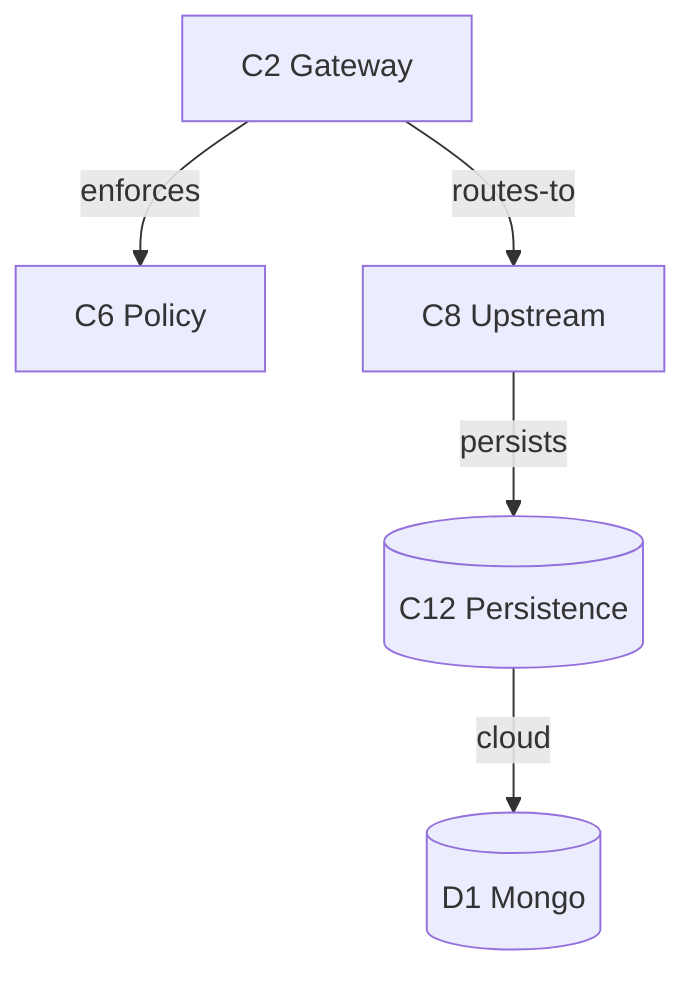

# Diagrams

A diagram is just another **rendering** of the map the markdown already encodes — not a new
analysis. Because the markdown obeys [schema v1](schema-v1.md), a renderer parses it into a
graph; no separate persisted model is needed.

## Drill-down maps onto C4 + a behavioral view

| Zoom level | Shows | From the map |
|---|---|---|
| **Context** | the system, actors, external deps | T0 Goal · Roles · T2 |
| **Container** | runtime pieces (services, datastores, sandboxes) | Deployment + components |
| **Component** | T1 components + their verbed arrows | T1 + the edge list |
| **Code** | entry points / classes → `file:line` | T4 / T5 anchors |
| **Behavioral overlay** | the Golden Path as a sequence that lights up the boxes each step touches | GP steps + traceability |

Drill down = zoom one level in; step back = zoom out — the same "name a row to drill"
navigation as the markdown, made visual.

**Context-diagram direction.** Actors (from Roles) point *into* the system — they initiate use
cases. External dependencies (from T2) point *out* — the system calls them. Keeping external
systems in T2 (not Roles) is what makes those arrows render the right way: an IdP, sandbox, or
upstream service is something the system *uses*, never an actor that uses the system.

## Diff as an overlay

Recolor the baseline graph from the annotated baseline-diff: **green = added, amber =
modified, red/ghosted = deleted** (re-draw deleted nodes just for the overlay), with a
show/hide toggle. The element-keyed deltas are the data.

## Edges and source links

- **Edges come from the verbed component edge list**, so every arrow carries its verb. Do
  not derive arrows from T1's coarse "Depends on".
- **Source links pin to the analysis commit SHA** so line drift doesn't break them.

## Realization tiers

- **Tier A — diagram-as-code (Mermaid / D2), generated from the markdown.** One diagram per
  level + a Golden Path sequence diagram, with `click`→source and diff via styled
  regeneration. Cheap, in-repo, version-controlled; "drill-down" is hyperlinked per-level
  diagrams rather than true zoom.
- **Tier B — a small self-contained HTML viewer** (Cytoscape.js / React Flow) reading the
  parsed graph. True zoom / step-back / overlay toggle / animated Golden Path; more build
  effort.

Reference frame: the **C4 model**, **Structurizr**, **Sourcetrail** — all standard. The
request to see architecture this way is not unusual.

## Example (Mermaid, Tier A)

A component diagram is the verbed edge list rendered directly:

