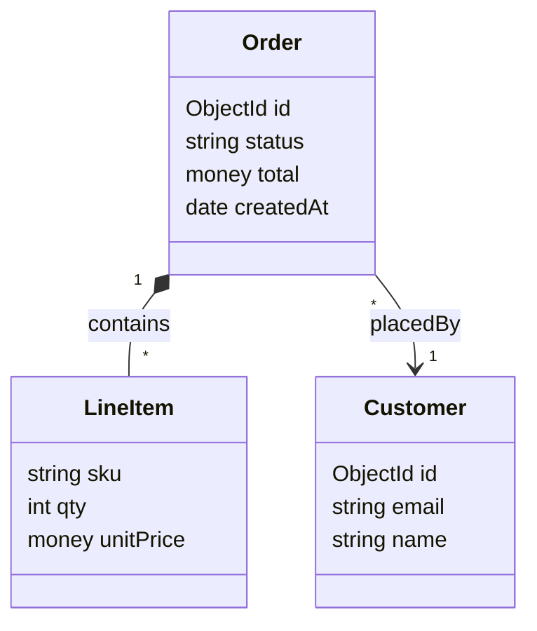

# Domain cards — the T5 domain model as a class diagram

T5 (the domain model) is authored as **per-entity cards**, not a flat table, and renders as a
Mermaid **`classDiagram`** — boxes with attributes inside and typed, cardinal relationships
between them. A card is a block with a defining heading and labeled lines, exactly the same
micro-format shape as a [Golden Path](method.md) step. One block holds everything about an
entity: its fields, its relations, its meaning, its source anchor — so you read an entity whole
instead of joining three tables.

This file specifies the format, then pressure-tests each shape decision against the alternative
it beats.

> **Why cards, not tables.** A class/ER view needs three things — entities, their **attributes**,
> and their **relationships**. Attributes are variable-length (an entity has 3 or 30 fields); a
> table cell holding 30 fields is unreadable, and splitting fields / relations into their own
> tables means an entity's identity, fields, and relations live in three places you can never see
> together. The Golden Path already solved this once: a step has rich internal structure (STORY /
> UNDER THE HOOD / `Touches:`) that a table can't hold, so it is a block with a dedicated parser.
> A domain entity is the same shape — so it gets the same treatment.

---

## The card grammar

One card per entity. The heading **defines** the `E` id (like `**GP1 — …**` defines a GP step);
labeled lines carry the rest:

```
**E<n> — <Name>** *(<stored where>)*
MEANING: <one-line meaning>
FIELDS: <field> · <field> · …            ← inline, OR a bullet list (see FIELDS)
RELATIONS: <relation> · <relation> · …
SOURCE: [<file>](<path>#L<line>)
```

| Part | Required | Holds | Parses to |
|---|---|---|---|
| heading `**En — Name** *(store)*` | yes | id, display name, store | node id / name + `fields.Stored` |
| `MEANING:` | yes | one-line gloss | `fields.Meaning` |
| `FIELDS:` | yes | attribute list | `node.attrs` |
| `RELATIONS:` | no | typed `E→E` edges | `edges` (carry `card` + `kind`) |
| `SOURCE:` | yes | `[text](path#Lnn)` | `node.file` / `node.line` |

- The heading em-dash `—` and the `*(…)*` metadata parens mirror the Golden Path heading
  (`**GP1 — title** *(UC1)*`). The parens carry "stored where" (the old T5 column). Optional.
- Separators inside `FIELDS` / `RELATIONS` are `·` — the same separator the `Touches:` line uses.
  **Never a raw `|`** (schema-v1 rule 3 — it breaks table parsing elsewhere in the file).

### FIELDS micro-format

Each field is `<name>: <type> [markers]`. Items are `·`-separated **or** one per line as a
bullet list — use bullets when an entity is field-heavy:

```
FIELDS: id:ObjectId PK · status:string · total:money · createdAt:date

FIELDS:
  - id: ObjectId PK
  - status: string
  - total: money
  - createdAt: date
```

Parse: split on `·` (or take each `- ` bullet); split each item on the first `:` → `name`,
`rest`; in `rest` the first token is `type`, the rest are markers.

- **type** — a scalar (`string int float bool money date ObjectId json` …) or an `E`-id for an
  embedded value object (`address: E7`). An `E`-typed field renders with the referenced entity's
  display name as its type (`Address address`); it does **not** auto-create a relation — draw the
  edge only by listing it in `RELATIONS` (keeps relationships single-sourced).
- **markers** (small controlled set): `PK`, `FK` (optionally `FK→E3` to name the target),
  `unique`, `?` (nullable), `[]` (collection).

### RELATIONS micro-format

Each relation, authored **on the source entity's card only** (one side — see "Single source"):

```
<verb> <srcCard>→<dstCard> <target-Eid> [display] · …
```

```
RELATIONS: contains 1→* E2 LineItem · placedBy *→1 E3 Customer · isA E9 Document
```

Parse one item with:

```
(?P<verb>[\w-]+)\s+(?:(?P<sc>\*|\d+|0\.\.1|1\.\.\*)→(?P<dc>\*|\d+|0\.\.1|1\.\.\*)\s+)?(?P<tgt>E\d+)
```

- `tgt` is the **ID reference** (resolved by the validator; display text may follow the id — schema
  rule 2: "display text may accompany the ID but the ID must be present").
- the edge is `(this card's id) --verb--> tgt`, carrying cardinality `(sc, dc)` and a **kind**.
- cardinality is optional (omit it for inheritance).
- allowed cardinality tokens: `1`, `*`, `0..1`, `1..*`.

**Verb → relationship kind → `classDiagram` arrow** (default map; verbs outside it are associations):

| verb keyword | kind | classDiagram arrow |
|---|---|---|
| `isA`, `extends` | inheritance | `E1 --|> E9` |
| `contains`, `owns`, `composedOf` | composition | `E1 "1" *-- "*" E2` |
| `aggregates`, `has` | aggregation | `E1 "1" o-- "*" E2` |
| anything else | association | `E1 "1" --> "*" E2` |

---

## Single source & cross-references

- **Entity↔entity relationships live only in card `RELATIONS`** — never in the backbone
  `From | Verb | To` edge list. The backbone list stays the home for component/dep edges; the card
  is the home for domain edges. One home per relationship → no drift. (The parser merges both into
  one edges list and filters by node kind per view, so they never collide on screen.)
- **Author each relation once**, on the source (`From`) side. If both `E1` and `E2` declare the
  same pair, that is a duplicate the validator warns on.
- **`E` ids are still global and stable**, so every existing cross-reference keeps working
  unchanged: the Golden Path `Touches:` line, the `Step | … | T5 entities` traceability column, and
  the T6 flow `Uses` column all still resolve to a card's `E` id. Only T5's *internal*
  representation changed (table → cards); its id contract did not.
- **`C→E` edges** ("a component persists an entity") may still be authored in the backbone edge
  list. They are not drawn in today's component view (entities aren't nodes there); they become the
  natural drill link "component → the entities it owns" when that view is built.

---

## Worked example (round-trip)

Three cards:

```
**E1 — Order** *(orders collection)*
MEANING: a customer's purchase, from cart to fulfillment
FIELDS: id:ObjectId PK · status:string · total:money · createdAt:date
RELATIONS: contains 1→* E2 LineItem · placedBy *→1 E3 Customer
SOURCE: [order.py](domain/order.py#L12)

**E2 — LineItem** *(embedded in Order)*
MEANING: one product line within an order
FIELDS: sku:string · qty:int · unitPrice:money
RELATIONS: refersTo *→1 E4 Product
SOURCE: [order.py](domain/order.py#L58)

**E3 — Customer** *(customers collection)*
MEANING: the buyer
FIELDS: id:ObjectId PK · email:string unique · name:string
SOURCE: [customer.py](domain/customer.py#L9)
```

Parse to nodes (with `attrs`) + edges (with `card` + `kind`):

```
E1 Order    attrs=[id:ObjectId(PK), status:string, total:money, createdAt:date]  store="orders collection"
E2 LineItem attrs=[sku:string, qty:int, unitPrice:money]
E3 Customer attrs=[id:ObjectId(PK), email:string(unique), name:string]

E1 --contains→ E2   card=(1,*)  kind=composition
E1 --placedBy→ E3   card=(*,1)  kind=association
E2 --refersTo→ E4   card=(*,1)  kind=association
```

Render as `classDiagram` (the box shows `type name`; PK/FK/unique/nullable markers show in the
viewer's click→panel, since `classDiagram` boxes have no native key notation):



`classDiagram` is the render target (decided): it takes arbitrary `"1"`/`"*"` cardinality labels
and shows methods later. `erDiagram` was rejected — it forces cardinality into a fixed crow's-foot
vocabulary (`*→1` becomes `}o--||`), a lossy mapping.

---

## Validation rules

The validator (when domain cards are implemented — see "Implementation status") checks:

- each card heading defines a **unique** `E` id (existing duplicate-definition machinery).
- every `RELATIONS` target resolves to a **defined** `E` (existing reference check — `E` is already
  in the ID token grammar).
- each relation pair `(a, b)` is declared on **one** side only → warn on both-sided duplicates.
- each `FIELDS` item has a non-empty `type`; each cardinality token is in `{1, *, 0..1, 1..*}`.
- `MEANING` and `SOURCE` present (the `SOURCE` anchor drives the confidence label).
- no raw `|` inside a card line.

---

## Design rationale (pressure-tested)

| Decision | Chosen | Rejected alternative |
|---|---|---|
| **Where attributes live** | per-entity **card** (block) | **Three tables** (entity / attributes / relations) — splits one entity across three places, unreadable for the join. **One wide table** with a packed `Attributes` cell — breaks "one fact per cell", unreadable past a few fields. |
| **Where relations live** | card `RELATIONS`, single-sourced per pair | **Backbone `From\|Verb\|To` edge list** — would co-mingle two edge semantics and dangle an ER-only cardinality column on every component row. |
| **Entity identity** | keep the global `E` id, defined in the heading | **Mermaid-as-source** (author a literal `classDiagram`) — code fences are stripped by the parser, so it is invisible as source; and class names are not `E` ids, so T6 / GP / traceability cross-refs break. |
| **Render target** | `classDiagram` | `erDiagram` — lossy cardinality mapping, no methods. |
| **Attribute ids** | none (fields are leaf reference data) | id-ing every field — explodes the id space, the same anti-pattern as mapping every class. |

The cost is one **second non-table micro-format** (the method had exactly one before: the Golden
Path). It is justified the same way the Golden Path is: an element with rich internal structure
that a table represents poorly.

---

## Implementation status

**Implemented and verified.** The tools below parse, validate, and render domain cards; the template
validates clean and the Domain `classDiagram` renders with a working click-bridge (verified in a
browser: clicking a class shows its fields + source, clicking a relation shows its kind +
cardinality).

1. **`tools/schema_v1.py`** — `DEF_ENTITY` heading definition (`E` is card-defined, removed from the
   table-row patterns); shared `iter_domain_cards` / `parse_card_fields` / `parse_card_relations`
   grammar (`RELATION_ITEM`, `ALLOWED_CARDINALITY`, `REL_KIND`).
2. **`tools/validate_analysis.py`** — `check_domain_cards` (MEANING/SOURCE/FIELDS present, every
   field typed, every relation well-formed, single-side); card ids ride the generic
   duplicate/undefined-reference checks.
3. **`tools/viewer/build_graph.py`** — `parse_domain` (modeled on `parse_gp`); `Node.attrs`,
   `Edge.kind` / `src_card` / `dst_card`.
4. **`tools/viewer/gen_viewer.py`** — `gen_domain_mermaid` emits the `classDiagram`; a **Domain**
   view button (hidden when the map has no entities).
5. **`tools/viewer/viewer.js`** — a classDiagram click-bridge (`bindDomain` / `eachClassEdge`):
   class group id `…-classId-E1-N` resolves via the id regex, relation path id `…-id_E1_E2_N`
   encodes its endpoints; the panel renders entity `attrs` and relation cardinality.

## Migration

Domain cards **replace** the T5 table (decided — no dual-format support). An existing map with a
T5 `| ID | Entity | … |` table must convert each row to a card: row → heading + `MEANING` /
`SOURCE`, then add `FIELDS` (and `RELATIONS` where the model has them). `E` ids are unchanged, so
no cross-reference anywhere else in the map has to move.
