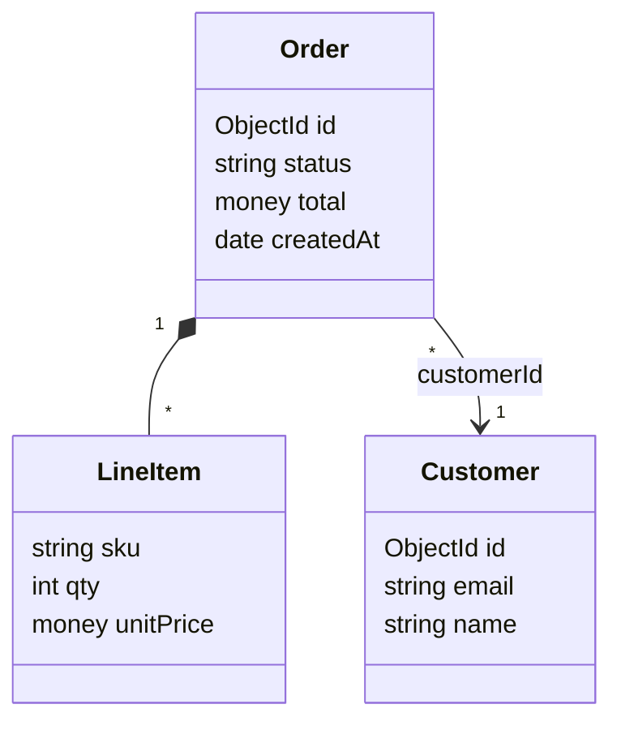

# Domain cards — the T5 domain model as a class diagram

T5 (the domain model) is authored as **per-entity cards**, not a flat table, and renders as a
Mermaid **`classDiagram`** — boxes with attributes inside and typed, cardinal relationships
between them. A card is a block with a defining heading and labeled lines, exactly the same
micro-format shape as a [Golden Path](method.md) step. One block holds everything about an
entity: its fields, its relations, its meaning, its source anchor — so you read an entity whole
instead of joining three tables.

This file specifies the format, then pressure-tests each shape decision against the alternative
it beats.

> **Why cards, not tables.** A class/ER view needs three things — entities, their **attributes**,
> and their **relationships**. Attributes are variable-length (an entity has 3 or 30 fields); a
> table cell holding 30 fields is unreadable, and splitting fields / relations into their own
> tables means an entity's identity, fields, and relations live in three places you can never see
> together. A **T6 use-case flow** already solves this once: a use case has rich internal structure (an
> ordered list of `from → to` steps) that a table can't hold, so it is a block with a dedicated parser.
> A domain entity is the same shape — so it gets the same treatment.

---

## The card grammar

One card per entity. The heading **defines** the `E` id (like `**GP1 — …**` defines a GP step);
labeled lines carry the rest:

```
**E<n> — <Name>** *(<stored where>)*
SUBDOMAIN: <SD-id>                        ← optional; the one subdomain the entity belongs to
MEANING: <one-line meaning>
FIELDS: <field> · <field> · …            ← inline, OR a bullet list (see FIELDS)
RELATIONS: <relation> · <relation> · …
SOURCE: [<file>](<path>:<line>)
```

| Part | Required | Holds | Parses to |
|---|---|---|---|
| heading `**En — Name** *(store)*` | yes | id, display name, store | node id / name + `fields.Stored` |
| `SUBDOMAIN:` | no | one `SD` id (the entity's subdomain) | `node.parent` |
| `MEANING:` | yes | one-line gloss | `fields.Meaning` |
| `FIELDS:` | yes | attribute list | `node.attrs` |
| `RELATIONS:` | no | typed `E→E` edges | `edges` (carry `card` + `kind`) |
| `SOURCE:` | yes | `[text](path:line)` | `node.file` / `node.line` |

> **`SUBDOMAIN:` groups the entity** into a bounded context (`SD`) — the domain-model analog of a
> component's `subsystem` field, single-sourced on the child. It is **optional and additive**: omit
> it and the entity is ungrouped (top-level). Subdomains are their own array (`id`, `name`,
> `purpose`, `parent`, `source`, `confidence`); the derived `SD→SD` / `S→SD` edges and the Domain
> bounded-contexts overview are never authored (see [the map model](model.md)).

- The heading em-dash `—` and the `*(…)*` metadata parens mirror the Golden Path heading
  (`**GP1 — title** *(UC1)*`). The parens carry "stored where" (the old T5 column). Optional.
- Separators inside `FIELDS` / `RELATIONS` are `·` — the same separator a T6 flow step's `· note` uses.

**An entity is a REAL named type.** A card maps to an actual `class` / dataclass / enum / struct /
typed-dict in the code, and its `SOURCE` anchors that **definition** (the `class X` / `@dataclass` /
enum line — not a construction or use site). Do **not** synthesize an entity for a concept with no
named type (an ad-hoc dict, a transient "state" that only lives inside a function): if `SOURCE`
can't point at a definition, it isn't a domain class — leave it out. Synthesized boxes clutter the
model with classes a reader can't open.

### FIELDS micro-format

Each field is `<name>: <type> [markers]`. Items are `·`-separated **or** one per line as a
bullet list — use bullets when an entity is field-heavy:

```
FIELDS: id:ObjectId PK · status:string · total:money · createdAt:date

FIELDS:
  - id: ObjectId PK
  - status: string
  - total: money
  - createdAt: date
```

Parse: split on `·` (or take each `- ` bullet); split each item on the first `:` → `name`,
`rest`; in `rest` the first token is `type`, the rest are markers. The two **suffix** markers
`[]` (collection) and `?` (nullable) may be written **spaced** (`tokens:E28 []`) **or glued** to
the type (`tokens:E28[]`) — the parser peels them off, so the bare type still resolves either way.
(Before this normalization, a glued `E28[]` silently failed: the box showed `E28` instead of the
entity name, and the relation arrow rendered unlabelled.)

- **type** — a scalar (`string int float bool money date ObjectId json` …) or an `E`-id for an
  embedded value object (`address: E7`). An `E`-typed field renders with the referenced entity's
  display name as its type (`Address address`); it does **not** auto-create a relation — draw the
  edge only by listing it in `RELATIONS` (keeps relationships single-sourced).
- **markers** (small controlled set): `PK`, `FK` (optionally `FK→E3` to name the target),
  `unique`, `?` (nullable), `[]` (collection). The two suffix markers (`?`, `[]`) may be glued to
  the type; the rest are space-separated.

### RELATIONS micro-format

Each relation, authored **on the source entity's card only** (one side — see "Single source"):

```
<verb> <srcCard>→<dstCard> <target-Eid> [display] [{how}] · …
```

```
RELATIONS: contains 1→* E2 LineItem · placedBy *→1 E3 Customer · isA E9 Document
RELATIONS: hasShipment 1→0..1 E7 Shipment · refersTo *→1 E4 Product
```

Parse one item with:

```
(?P<verb>[\w-]+)\s+(?:(?P<sc>\*|\d+|0\.\.1|1\.\.\*)→(?P<dc>\*|\d+|0\.\.1|1\.\.\*)\s+)?(?P<tgt>E\d+)
```

- `tgt` is the **ID reference** (resolved by the validator; display text may follow the id — schema
  rule 2: "display text may accompany the ID but the ID must be present").
- the edge is `(this card's id) --verb--> tgt`, carrying cardinality `(sc, dc)` and a **kind**.
- cardinality, when present, is **always a pair** `srcCard→dstCard` — both sides or neither (omit the
  pair entirely for inheritance). A **lone** token like `contains 0..1 E2` has no `→`, so it is **not**
  valid and fails to parse; write the pair, e.g. `contains 1→0..1 E2`.
- each side of the pair is one of: `1`, `*`, `0..1`, `1..*` — e.g. `1→0..1`, `*→1`, `0..1→*`.
- an optional trailing **`{how}` note** is a plain-text explanation of how a *field-less* relation is
  implemented — `tracks *→1 E11 {keyed by (org_id, upstream_id) in the connection store}`. It is
  peeled off before the grammar match and shown in the click-panel's **Implemented by** line (a `·`
  may not appear inside it — it is the item separator). Use it for the indirect / key-composition
  links that no single field backs; the validator warns on a field-less **association** that has
  neither a backing FK nor a note (see "Arrow labels").

**One canonical verb per relationship kind** — the verb selects the `classDiagram` arrow; use
exactly the canonical verb (the validator rejects aliases). Association is free-form: any other
verb; it picks the plain arrow and shows in the click-panel, but is **never drawn as a label**
(only real field names are — see "Arrow labels").

| kind | **canonical verb** | classDiagram arrow | meaning |
|---|---|---|---|
| inheritance | `isA` | `E1 --|> E9` | E1 is a kind of E9 |
| composition | `contains` | `E1 "1" *-- "*" E2` | the part's lifecycle is bound to the whole |
| aggregation | `has` | `E1 "1" o-- "*" E2` | the part can exist independently of the whole |
| association | the domain verb (e.g. `placedBy`) | `E1 "1" --> "*" E2` | any other relationship |

Aliases the validator rejects in favour of the canonical verb: `owns` / `composedOf` → `contains`,
`aggregates` → `has`, `extends` → `isA`.

**Arrow labels are REAL field names, never the verb.** The marker already conveys the kind, and an
invented relationship verb (`authorizes`, `pinnedTo`, `identifies`) isn't grounded in the code — so
a label is shown **only when a real field backs the relation**. **One** resolution (in `build_graph`,
`resolve_backing`) finds that field and feeds *both* the canvas label and the panel's **Implemented
by** line, so the two never drift:

- **forward** — a field on the *source* that is **typed by the target** (`subscription:E15`) **or
  marked `FK→target`** (`role:string FK→E5`) → that **field name** (`subscription`, `role`);
- **reverse** — the *target's* foreign key back to the source (`FK→source`) → **`↩ field`**
  (`↩ org_id`), the `↩` flagging that the field lives on the far / arrow-head end;
- **otherwise → blank**, and the relation should carry a **`{how}` note** (see RELATIONS
  micro-format) — the marker + the target box convey the *kind*, but a field-less relation needs
  prose to say *how* it is wired (it is keyed in a store, composed from two ids, …).

Forward wins over reverse when a field exists on both sides (show the near-side field). FK markers
match the whole id token, so `FK→E1` never matches `E11`.

> **Why symmetric forward/reverse.** A foreign key on the *source* (`role:string FK→E5`, the common
> child→parent association) used to render **nothing**, while the same shape on the *target* rendered
> `↩ field` — so of many FK relations only the rare reverse one was ever labelled, which read as
> random. Matching `FK→` on *either* side makes a marked FK show its field whichever card authored
> the relation; the `{how}` note covers the rest.

To make a relation field-backed (and thus labelled), either **type the field by its entity** —
`auth:E7`, `clients:E17 []`, not `json` — or **mark the foreign key with its target** —
`org_id:string FK→E1`, `role:string FK→E5` — on whichever side the column actually lives. A relation
that no single field implements (key-composition, a derived view) takes a `{how}` note instead.

---

## Single source & cross-references

- **Entity↔entity relationships live only in card `RELATIONS`** — never in the backbone
  `From | Verb | To` edge list. The backbone list stays the home for component/dep edges; the card
  is the home for domain edges. One home per relationship → no drift. (The parser merges both into
  one edges list and filters by node kind per view, so they never collide on screen.)
- **Author each relation once**, on the source (`From`) side. If both `E1` and `E2` declare the
  same pair, that is a duplicate the validator warns on.
- **`E` ids are still global and stable**, so every existing cross-reference keeps working
  unchanged: a T6 flow step's endpoint, the backbone edge list, and the `C→E` edges all still resolve
  to a card's `E` id. Only T5's *internal* representation changed (table → cards); its id contract did
  not.
- **`C→E` edges are first-class — harvest them with the edge list.** A component's relationship to
  the domain model is a backbone edge `C — persists/writes/reads → E` (persists/writes = the component
  **owns** the entity, i.e. is its system of record — typically its repository; reads = it
  **consumes** it). They live in the backbone edge list like every C-edge; only E↔E relations stay on
  the cards. They already drive the **subsystem→subdomain bridge** (owns/reads) and the
  component↔class cross-links — so they are no longer "optional, drawn later". Author **one
  `persists`/`writes` owner per entity** (the repository) plus a `reads` edge from each component that
  **directly** references the entity type — never a transitive one (a controller that merely calls a
  service that reads `E` gets no `C→E` edge). An entity with no owner is an embedded value object or a
  DTO — fine, just unowned.

---

## Worked example (round-trip)

Three cards:

```
**E1 — Order** *(orders collection)*
MEANING: a customer's purchase, from cart to fulfillment
FIELDS: id:ObjectId PK · status:string · total:money · createdAt:date · customerId:ObjectId FK→E3
RELATIONS: contains 1→* E2 LineItem · placedBy *→1 E3 Customer
SOURCE: [order.py](domain/order.py:12)

**E2 — LineItem** *(embedded in Order)*
MEANING: one product line within an order
FIELDS: sku:string · qty:int · unitPrice:money
RELATIONS: refersTo *→1 E4 Product
SOURCE: [order.py](domain/order.py:58)

**E3 — Customer** *(customers collection)*
MEANING: the buyer
FIELDS: id:ObjectId PK · email:string unique · name:string
SOURCE: [customer.py](domain/customer.py:9)
```

Parse to nodes (with `attrs`) + edges (with `card` + `kind`):

```
E1 Order    attrs=[id:ObjectId(PK), status:string, total:money, createdAt:date, customerId:ObjectId(FK→E3)]
E2 LineItem attrs=[sku:string, qty:int, unitPrice:money]
E3 Customer attrs=[id:ObjectId(PK), email:string(unique), name:string]

E1 --contains→ E2   card=(1,*)  kind=composition   backing: none (no field on E1 typed E2) → blank label
E1 --placedBy→ E3   card=(*,1)  kind=association    backing: E1.customerId (FK→E3), forward → label "customerId"
E2 --refersTo→ E4   card=(*,1)  kind=association    (E4 is defined elsewhere; not drawn in this 3-card slice)
```

Render as `classDiagram` (the box shows `type name`; PK/FK/unique/nullable markers show in the
viewer's click→panel, since `classDiagram` boxes have no native key notation). The arrow carries the
**backing field name**, never the verb — `placedBy` is implemented by `Order.customerId`, so the
arrow reads `customerId`; the composition has no backing field, so it is unlabelled:



`classDiagram` is the render target (decided): it takes arbitrary `"1"`/`"*"` cardinality labels
and shows methods later. `erDiagram` was rejected — it forces cardinality into a fixed crow's-foot
vocabulary (`*→1` becomes `}o--||`), a lossy mapping.

---

## Validation rules

The validator (when domain cards are implemented — see "Implementation status") checks:

- each card heading defines a **unique** `E` id (existing duplicate-definition machinery).
- every `RELATIONS` target resolves to a **defined** `E` (existing reference check — `E` is already
  in the ID token grammar).
- each relation pair `(a, b)` is declared on **one** side only → warn on both-sided duplicates.
- each `FIELDS` item has a non-empty `type`; each cardinality token is in `{1, *, 0..1, 1..*}`.
- `MEANING` and `SOURCE` present (the `SOURCE` anchor drives the confidence label).
- the relation verb is the canonical one for its kind (aliases rejected — see the verb table).
- no raw `|` inside a card line.

It also emits a **non-blocking warning** (printed, but the build still passes) for a completeness
gap: an **association** that no field backs (no `FK→`/typed field on either side) **and** has no
`{how}` note — such an arrow draws nothing on the canvas and explains nothing in the panel, so the
reader can't tell how the link is wired. Fix it by marking the implementing field `FK→target` (or
`FK→source` on the other card) or adding a `{how}` note. Structural kinds (composition / aggregation
/ inheritance) are exempt — their marker already conveys the implementation.

**Opt-in source check (`--check-sources`).** Reads each card's `SOURCE` file and rejects an entity
whose name has no identifier token present there — catching **synthesized** entities (a name with no
real named type, e.g. `OAuthState`) and wrong anchors. Tokens are any identifier shape (CamelCase,
`snake_case`, or lowercase), matched case-insensitively by *substring*, so an abbreviated
(`ServiceToken` ⊂ `ServiceTokenRecord`), compound (`A / B`), or suffixed (`Settings (app env)`) name
still passes. A departure from map-only validation (it reads the analyzed repo), so it's a flag the
build passes, not a default check.

---

## Design rationale (pressure-tested)

| Decision | Chosen | Rejected alternative |
|---|---|---|
| **Where attributes live** | per-entity **card** (block) | **Three tables** (entity / attributes / relations) — splits one entity across three places, unreadable for the join. **One wide table** with a packed `Attributes` cell — breaks "one fact per cell", unreadable past a few fields. |
| **Where relations live** | card `RELATIONS`, single-sourced per pair | **Backbone `From\|Verb\|To` edge list** — would co-mingle two edge semantics and dangle an ER-only cardinality column on every component row. |
| **Entity identity** | keep the global `E` id, defined in the heading | **Mermaid-as-source** (author a literal `classDiagram`) — code fences are stripped by the parser, so it is invisible as source; and class names are not `E` ids, so T6 / GP / traceability cross-refs break. |
| **Render target** | `classDiagram` | `erDiagram` — lossy cardinality mapping, no methods. |
| **Attribute ids** | none (fields are leaf reference data) | id-ing every field — explodes the id space, the same anti-pattern as mapping every class. |

The cost is one **second non-table micro-format** (the method had exactly one before: the Golden
Path). It is justified the same way the Golden Path is: an element with rich internal structure
that a table represents poorly.

---

## Implementation status

**Implemented and verified.** The tools below parse, validate, and render domain cards; the template
validates clean and the Domain `classDiagram` renders with a working click-bridge (verified in a
browser: clicking a class shows its fields + source, clicking a relation shows its kind +
cardinality).

1. **`tools/coyodex/model.py`** — `Entity` / `EntityField` / `EntityRelation` are the model's own
   typed fields (`fields`, `relations`), not a parsed card; `grammar.py` holds the shared relation
   vocabulary (`REL_KIND`, the backing resolver `resolve_backing` + `fk_targets`, token-exact `FK→`
   matching).
2. **`tools/coyodex/validate_model.py`** — `_check_domain_cards` (MEANING/SOURCE/FIELDS present, every
   field typed, every relation well-formed, single-side); plus a non-blocking warning for a
   field-less, note-less association. Card ids ride the generic duplicate/undefined-reference checks.
3. **`tools/coyodex/views.py`** — `model_to_graph` builds each entity's `Node.attrs` and each
   relation's `Edge.kind` / `src_card` / `dst_card` straight from the model, resolving each
   relation's backing field into `Edge.fk_field` / `Edge.fk_side` and carrying the `{how}` note as
   `Edge.how`.
4. **`tools/coyodex/viewer/gen_viewer.py`** — `gen_domain_mermaid` emits the `classDiagram`; `_relation_label`
   formats the resolved `fk_field` / `fk_side` into the arrow label (plain forward, `↩` reverse); a
   **Domain** view button (hidden when the map has no entities).
5. **`tools/coyodex/viewer/viewer.js`** — a classDiagram click-bridge (`bindDomain` / `eachClassEdge`):
   class group id `…-classId-E1-N` resolves via the id regex, relation path id `…-id_E1_E2_N`
   encodes its endpoints; the panel renders entity `attrs`, relation cardinality, and an **Implemented
   by** line (the backing field, or the authored `{how}` note for a field-less relation).

## Migration

Domain cards **replace** the T5 table (decided — no dual-format support). An existing map with a
T5 `| ID | Entity | … |` table must convert each row to a card: row → heading + `MEANING` /
`SOURCE`, then add `FIELDS` (and `RELATIONS` where the model has them). `E` ids are unchanged, so
no cross-reference anywhere else in the map has to move.
